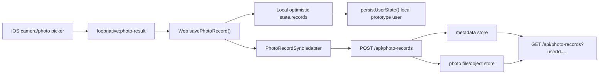

# LOOP 照片记录后端持久化设计

日期：2026-06-24

## 背景

当前照片记录链路已经具备 app 侧入口：

- Web 通过 `camera.capture` / `photo.pick` 请求 iOS 原生相机或相册。
- iOS 通过 `loopnative:photo-result` 回传压缩后的 `imageDataUrl`、尺寸、mime type 和站点信息。
- Web 的 `savePhotoRecord(routeItem, source, photoAsset)` 会把照片写入 `state.records`。
- `persistUserState()` 会把 `state.records` 写回本地 prototype 用户，即浏览器 `localStorage` 里的用户对象。

这说明当前体验可以在本机原型里保存照片记录，但不是后端持久化：换设备、清缓存、重新安装 app 或上线生产后，都不能依赖这套本地存储。

## 关键约束

- WebView-first 继续保留：UI 和记录列表仍由 Web 层负责。
- 不能把大图 base64 长期塞进用户 JSON。需要把照片二进制和记录 metadata 分开。
- iOS app 使用本地打包 Web 资产，不天然等于有同源后端。生产模式必须有明确 API base URL。
- 当前 auth 仍是 prototype localStorage 用户，不是生产账号系统。
- 本阶段不能假装已经有生产对象存储、CDN、登录态、支付态或风控。

## 目标

- 定义照片记录后端持久化的 API contract。
- 规划一个可本地验证的 dev backend，让 Web 可以把照片记录同步到服务端。
- 保留本地乐观更新：即使后端不可用，当前照片记录体验不回退。
- 为后续生产化留下清楚边界：API base、账号、图片存储、隐私标签和同步冲突都要能替换。

## 非目标

- 不在本阶段接真实云存储、数据库、CDN 或 App Store 生产后端。
- 不重写账号系统。
- 不上传原图；继续使用 iOS 已压缩后的 JPEG/Web data URL 输入。
- 不实现跨用户权限模型。
- 不改变当前记录 UI 和照片详情 UI。
- 不在 Swift 层直接上传照片；Swift 仍只负责系统相机/相册，上传由 Web 数据层处理。

## 方案比较

### 方案 A：直接把 `state.records` 整包 POST 到后端

优点是最少代码。缺点是会把照片 data URL、历史记录和用户状态混在一起，数据体积不可控，也很难做冲突合并和隐私标签说明。

### 方案 B：新增照片记录 API，metadata 和图片文件分开

优点是边界清楚：Web 仍先本地保存，再把单次照片记录同步到后端；服务端把图片落到文件或对象存储，把记录 metadata 落到 JSON/数据库。缺点是实现多一步。

### 方案 C：Swift 原生直接上传

优点是可控原生上传体验。缺点是会绕开 Web 当前记录模型，需要 Swift 理解路线、用户和记录结构，违背 WebView-first。

本阶段选择方案 B。

## 目标架构



## API Contract

### `POST /api/photo-records`

用途：保存一次照片记录。

请求：

```json
{
  "clientRecordId": "rec-photo-176-sh-coffee-pass",
  "clientPhotoId": "rec-photo-176-sh-coffee-pass-2",
  "userId": "demo-user-id",
  "city": "shanghai",
  "routeId": "sh-coffee-pass",
  "routeTitle": "上海咖啡地图 Vol.01",
  "layer": "coffee",
  "station": "O.P.S. Cafe",
  "stopIndex": 2,
  "source": "拍照",
  "capturedAt": "2026-06-24T19:30:00.000Z",
  "mimeType": "image/jpeg",
  "width": 1280,
  "height": 960,
  "imageDataUrl": "data:image/jpeg;base64,..."
}
```

响应：

```json
{
  "ok": true,
  "record": {
    "id": "srv-rec-001",
    "clientRecordId": "rec-photo-176-sh-coffee-pass",
    "clientPhotoId": "rec-photo-176-sh-coffee-pass-2",
    "userId": "demo-user-id",
    "photoUrl": "/api/photo-records/srv-photo-001.jpg",
    "syncedAt": "2026-06-24T19:30:03.000Z"
  }
}
```

失败：

- `400 INVALID_PAYLOAD`
- `413 PHOTO_TOO_LARGE`
- `415 UNSUPPORTED_IMAGE_TYPE`
- `409 DUPLICATE_PHOTO`
- `500 PHOTO_RECORD_SAVE_FAILED`

### `GET /api/photo-records?userId=...`

用途：读取某个 prototype 用户已同步的照片记录。

响应：

```json
{
  "ok": true,
  "records": [
    {
      "id": "srv-rec-001",
      "clientRecordId": "rec-photo-176-sh-coffee-pass",
      "clientPhotoId": "rec-photo-176-sh-coffee-pass-2",
      "routeId": "sh-coffee-pass",
      "station": "O.P.S. Cafe",
      "photoUrl": "/api/photo-records/srv-photo-001.jpg",
      "syncedAt": "2026-06-24T19:30:03.000Z"
    }
  ]
}
```

## Web 数据层设计

新增轻量 adapter：

- `photoRecordApiBase()`：读取 `window.LOOP_API_BASE_URL`、`document.documentElement.dataset.apiBase` 或 localStorage 开发配置；为空时禁用后端同步。
- `buildPhotoRecordPayload(routeItem, source, photoAsset, record, photo)`：从现有 `savePhotoRecord()` 上下文构造 payload。
- `syncPhotoRecord(payload)`：后台 `fetch` 到 `POST /api/photo-records`，成功后给本地 photo 标记 `syncStatus: "synced"` 和 `remotePhotoUrl`。
- 失败时保留本地记录，标记 `syncStatus: "pending"` 或 `syncError`，不打断用户拍照体验。

本地 Web 原型和 iOS 离线包默认 API base 为空，因此不会误向不存在的后端发送请求。开发者可以在浏览器里手动设置 API base 或通过后续 native config 注入。

## Dev Backend 设计

在 `server.mjs` 增加 dev-only 文件存储：

- metadata：`.loop-data/photo-records.json`
- 图片文件：`.loop-data/photos/<safe-id>.jpg`
- 静态读取：`GET /api/photo-records/photos/<file>`

约束：

- 单张 data URL 最大 900 KB。
- 只接受 `image/jpeg` 和 `image/png`。
- `clientPhotoId` 去重。
- `.loop-data/` 必须被 `.gitignore` 忽略。

这不是生产存储，只是让本机和后续 staging 可以验证 API contract。

## 验证策略

- 新增 `scripts/verify-photo-record-persistence.mjs`：
  - 静态检查 `server.mjs` 是否有 `POST /api/photo-records` 和 `GET /api/photo-records`。
  - 静态检查 `script.js` 是否有 `syncPhotoRecord`、`photoRecordApiBase`、`syncStatus`。
  - 可选启动 server 做一次小图片 data URL 的 POST/GET smoke。
- `npm test` 先不强制包含它，避免每次测试启动 server；新增 `npm run photo:persistence-check` 单独守门。
- 阶段完成时 `ios:release-check` 不需要依赖后端，因为 TestFlight 仍可在无生产后端时测试本地原型。

## 分阶段实施建议

### 阶段 3A：本地 dev backend 和 Web sync adapter

实现 API contract、dev 文件存储、Web 后台同步和守门脚本。默认 API base 为空，不影响当前线上原型。

### 阶段 3B：生产 API base 和真实账号

Vera 确认生产域名、账号系统和部署方式后，再让 iOS/Web 注入真实 API base，并把 userId 从 prototype id 替换成真实账号 id。

### 阶段 3C：对象存储和隐私标签最终化

把 dev 文件存储换成对象存储/CDN，补齐隐私标签、数据删除、用户导出和审核说明。

## 需要 Vera 之后确认的事项

- 生产 API 域名。
- 正式账号系统是否沿用现有本地账号形态，还是接 Apple 登录。
- 照片是否需要云端原图、压缩图，或只保存低清凭证图。
- 用户是否能删除云端照片记录。
- 是否需要同步到城市通行证核销或支付订单。
