# iOS 登录后截图场景设计

日期：2026-06-25
阶段：3D-2
范围：LOOP 城市回路 WebView-first Apple app

## 背景

阶段 3D-1 已建立 `npm run ios:screenshots`，可以用 iPhone Simulator 生成登录首屏基线截图，并输出 `manifest.json`。当前问题是截图包仍只复用 `ios:smoke`，无法进入登录后的真实产品页面。

本阶段目标不是制作最终 App Store 营销截图，也不是接入真实账号系统，而是建立稳定、可复跑、不会影响普通用户的登录后截图场景入口。这样后续可以在同一套机制上补正式文案、城市选择、设备尺寸和最终审稿。

## 已确认范围

Vera 已确认本阶段采用推荐截图范围：

- 登录首屏
- 今日首页
- 地图页
- 我的页
- 我的记录 sticky 表头状态

这组截图覆盖 App Store 初版叙事所需的主要路径：登录入口、今日推荐、兴趣地图、个人空间，以及最近确认过的记录表头交互。

## 非目标

- 不上传 App Store Connect。
- 不接入真实线上账号。
- 不改普通用户登录流程。
- 不新增营销文案覆盖层。
- 不把截图机制做成宽泛的远程调试入口。
- 不重写 Web UI 或 SwiftUI 外壳。
- 不把所有页面状态一次性穷举完。

## 方案比较

### 推荐方案：截图场景参数 + Web 内部场景启动器

在 iOS shell 中读取一个仅截图脚本使用的环境变量，例如 `LOOP_SCREENSHOT_SCENARIO`。如果存在，原生加载本地 `index.html` 时附加查询参数，例如：

```text
index.html?loopScreenshotScenario=profile-records
```

Web 层在初始化后读取这个参数，只在值合法时执行受控场景启动器：

- 确保 demo 用户存在。
- 使用 demo 用户登录态。
- 切到指定视图。
- 对需要滚动的截图设置稳定滚动位置。
- 给根节点加上可检测的 `data-screenshot-scenario`。

优点：改动窄；不影响普通用户；复用现有 demo 数据；截图脚本可以按场景循环；后续扩展场景只加白名单。

风险：Web 初始化和截图时机需要稳定判定，不能只靠固定等待。

### 备选方案：用 Simulator 手动点击“使用体验账号”

截图脚本安装 app 后，通过坐标点击 demo 登录按钮和底部导航。

优点：更接近真实用户交互。

缺点：坐标对设备、字体、启动时机和页面动画很敏感；失败时难排查；不适合作为长期自动化基线。

### 备选方案：XCTest UI test 驱动

用 Xcode UI test 启动 app、点击 WebView 内元素并截图。

优点：长期上架链路可能更标准。

缺点：当前项目还在 WebView-first 原型到 app 的早期阶段；XCTest 点击 WKWebView 内部内容需要更多辅助可访问性设计，阶段成本偏高。

## 设计

### 场景白名单

本阶段只支持以下场景：

- `login`：保持现有登录首屏。
- `home`：登录 demo 账号后进入今日首页。
- `atlas`：登录 demo 账号后进入地图页。
- `folio`：登录 demo 账号后进入我的页顶部。
- `profile-records`：登录 demo 账号后进入我的页，并滚动到“今日探索”和统计卡片的 sticky 表头状态。

`login` 继续作为默认场景。任何未知场景都应回退到 `login`，避免脚本参数拼错时进入不可预测状态。

### iOS shell

`WebViewScreen.swift` 保持 WebView-first。只新增一个很窄的读取入口：

- 从 `ProcessInfo.processInfo.environment["LOOP_SCREENSHOT_SCENARIO"]` 读取场景名。
- 仅允许小写字母、数字和连字符，且只用于本地 file URL 查询参数。
- 普通 app 启动时没有这个环境变量，继续加载无查询参数的 `index.html`。

这样不会改变线上网页，也不会改变用户正常打开 iOS app 的入口。

### Web 场景启动器

`script.js` 新增小型内部函数，建议命名为 `applyScreenshotScenario()`。

运行时机放在现有初始化流程之后：

```js
resetPrototypeStorageIfNeeded();
initAuth();
bindEvents();
schedulePhotoSyncRetry();
render();
applyScreenshotScenario();
```

场景启动器只做本阶段需要的最小动作：

- 读取 `new URLSearchParams(window.location.search).get("loopScreenshotScenario")`。
- 对场景名做白名单校验。
- `login` 清除当前 auth session，并显示登录门，避免前一个截图场景留下 demo 登录态。
- 其他场景调用现有 `ensureDemoUser()` 和 `setAuthenticatedUser(demoUser, true)`。
- 根据场景调用 `switchView("home")`、`switchView("atlas")` 或 `switchView("folio")`。
- `profile-records` 在 `folio` 渲染后滚动 `dom.appFrame`，让记录区 sticky 表头贴近顶部。
- 在稳定状态完成后设置 `document.documentElement.dataset.screenshotScenario = scenario`。

这个函数不应暴露到 `window`，也不应接受任意 JS 指令。

### 截图脚本

`ios-screenshot-pack.mjs` 从“设备循环”扩展为“设备 × 场景循环”。

默认设备继续是：

- `iPhone 17 Pro Max`
- `iPhone 17 Pro`

默认场景为：

- `login`
- `home`
- `atlas`
- `folio`
- `profile-records`

每张截图输出路径：

```text
.loop-artifacts/ios-screenshots/<device-slug>/<scenario>.png
```

`manifest.json` 中每条截图记录：

- `device`
- `slug`
- `screen`
- `scenario`
- `path`
- `width`
- `height`
- `bytes`

### smoke 脚本

`ios-simulator-smoke.mjs` 新增环境变量透传：

- `LOOP_IOS_SMOKE_SCENARIO`

如果设置，则通过 `SIMCTL_CHILD_` 环境变量传给 app。当前 `simctl launch` 帮助信息明确说明，启动 app 的环境变量要在调用环境里使用 `SIMCTL_CHILD_` 前缀，而不是 `launch --env` 参数：

```sh
SIMCTL_CHILD_LOOP_SCREENSHOT_SCENARIO="<scenario>" xcrun simctl launch <udid> <bundleId>
```

如果不设置，继续保持现有 smoke 行为。

截图判定仍保留 PNG 像素分布检查，避免白屏、黑屏和系统切换帧误判。登录后页面不一定都有完全一样的视觉比例，所以本阶段不要为不同场景引入复杂像素模板；只要求截图足够大、非空、包含 LOOP 主视觉颜色，并通过基础尺寸检查。

## 数据流

```mermaid
flowchart LR
  A["ios-screenshot-pack.mjs"] --> B["设置设备和场景环境变量"]
  B --> C["ios-simulator-smoke.mjs"]
  C --> D["SIMCTL_CHILD_LOOP_SCREENSHOT_SCENARIO + simctl launch"]
  D --> E["WebViewScreen.swift"]
  E --> F["index.html?loopScreenshotScenario=..."]
  F --> G["script.js applyScreenshotScenario"]
  G --> H["demo 登录态和目标页面"]
  H --> I["simctl screenshot"]
  I --> J["manifest.json"]
```



## 错误处理

- 场景名未知：Web 回退 `login`，脚本仍会生成截图，但 manifest 记录的 `scenario` 保持脚本请求值；后续静态检查会尽量防止未知场景进入默认列表。
- demo 用户缺失或版本旧：复用 `ensureDemoUser()` 自动创建或升级。
- 目标页面滚动失败：保留页面顶部截图，不抛运行时错误；但后续可用静态或视觉检查收紧。
- Simulator 设备缺失：沿用当前截图包脚本的失败方式，允许通过 `LOOP_IOS_SCREENSHOT_DEVICES` 覆盖。
- 截图像空白或系统帧：沿用 `ios-simulator-smoke.mjs` 的 PNG metrics 超时失败。

## 验证

新增或更新静态检查，至少覆盖：

- `script.js` 包含 `loopScreenshotScenario`、场景白名单、`applyScreenshotScenario`。
- `WebViewScreen.swift` 包含 `LOOP_SCREENSHOT_SCENARIO` 和查询参数拼接。
- `ios-simulator-smoke.mjs` 包含 `LOOP_IOS_SMOKE_SCENARIO` 和 `SIMCTL_CHILD_LOOP_SCREENSHOT_SCENARIO`。
- `ios-screenshot-pack.mjs` 包含默认场景列表和 `<scenario>.png` 输出。

实现后运行：

```sh
npm run ios:release-check
npm run ios:screenshots
```

阶段结束前运行完整验证：

```sh
npm run data:check
npm run ui:check
npm run check
npm test
npm run photo:persistence-check
npm run ios:check
npm run ios:release-check
npm run ios:build
npm run ios:smoke
npm run ios:screenshots
```

## 成功标准

- `npm run ios:screenshots` 默认生成 2 个设备 × 5 个场景，共 10 张 PNG。
- 登录首屏仍保留原样。
- 登录后四个场景都使用 demo 用户数据，不要求真实网络账号。
- 普通 iOS app 启动不带截图参数，行为不变。
- manifest 清晰记录每张截图的设备、场景、路径和 PNG 尺寸。
- `CURRENT_STATE.md` 更新阶段 3D-2 状态，未来窗口能从 repo 文件继续。

## 后续阶段

本阶段完成后，下一步可以做：

- 正式 App Store 截图文案和排序。
- 城市通行证详情截图。
- 真机截图 smoke。
- TestFlight 签名和上传链路。
